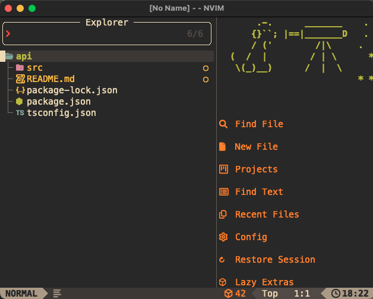

# GlitchDetected Dotfiles


###### _Filed away in my `$HOME`_

## 🚀 Installing

### Prerequisites

- A [Nerd Font](https://www.nerdfonts.com/) installed and enabled in your terminal (I recommend [FiraCode Nerd Font](https://www.nerdfonts.com/font-downloads)).

- Apple's Command Line Tools (MacOS Only):
```zsh
xcode-select --install
```

Bootstrap and install script:
```zsh
git clone https://github.com/glitchdetected1/dotfiles.git ~/.dotfiles && cd ~/.dotfiles && source bootstrap.sh
```

To Update, `cd` into `~/.dotfiles` and run this:
```zsh
source bootstrap.sh
```

Adding `~/.extras`:
```zsh
# Git credentials
# Not in the repository, to prevent people from accidentally committing under my name/email
GIT_AUTHOR_NAME="some one"
GIT_COMMITTER_NAME="$GIT_AUTHOR_NAME"
git config --global user.name "$GIT_AUTHOR_NAME"
GIT_AUTHOR_EMAIL="random@email.com"
GIT_COMMITTER_EMAIL="$GIT_AUTHOR_EMAIL"
git config --global user.email "$GIT_AUTHOR_EMAIL"
```
`~/.extra` is a file with very sensitive information so it can not be in this repository. You could also use `~/.extra` to override settings, functions and aliases from the dotfiles.

> [!TIP]
> Use `git config --list` to list gitconfig information

### My MacOS defaults

When setting up a new Mac, you may want to set some useful MacOS defaults:

```bash
./.macos
```

### Install Homebrew formulae

When setting up a new Mac, you may want to install some common [Homebrew](https://brew.sh/) formulae (If you are using `Homebrew`):

```bash
./brew.sh
```
If you don’t plan to run `brew.sh`, you should look carefully through the script and manually install any particularly important ones. A good example is Bash/Git completion: the dotfiles use a special version from Homebrew.


Additionally, if you have `iTerm2` you can set the theme by:
`iTerm2>Preferences>Profiles>Colors` 
Then import the `init/space.itermcolors` file (`~/init` contains terminal themes)

## Feedback
Send some feedback, suggestions, stuff like that here
[welcome](https://github.com/glitchdetected1/dotfiles/issues)!

## Author

| 
|---|
| [GlitchDetected](https://www.youtube.com/watch?v=dQw4w9WgXcQ) |

## Acknowledgements
This is where I got the inspiration and some of the code. Huge thanks to these people!

* [mathiasbynens](https://github.com/mathiasbynens) and his [dotfiles](https://github.com/mathiasbynens/dotfiles)
* [craftzdog](https://github.com/craftzdog) and his [dotfiles and nvim configurations](https://github.com/craftzdog/dotfiles-public)
* [morhetz](https://github.com/morhetz) for [gruvbox](https://github.com/morhetz/gruvbox)
* [jdah](https://github.com/jdah) for [zsh scripts](https://github.com/jdah/dotfiles)